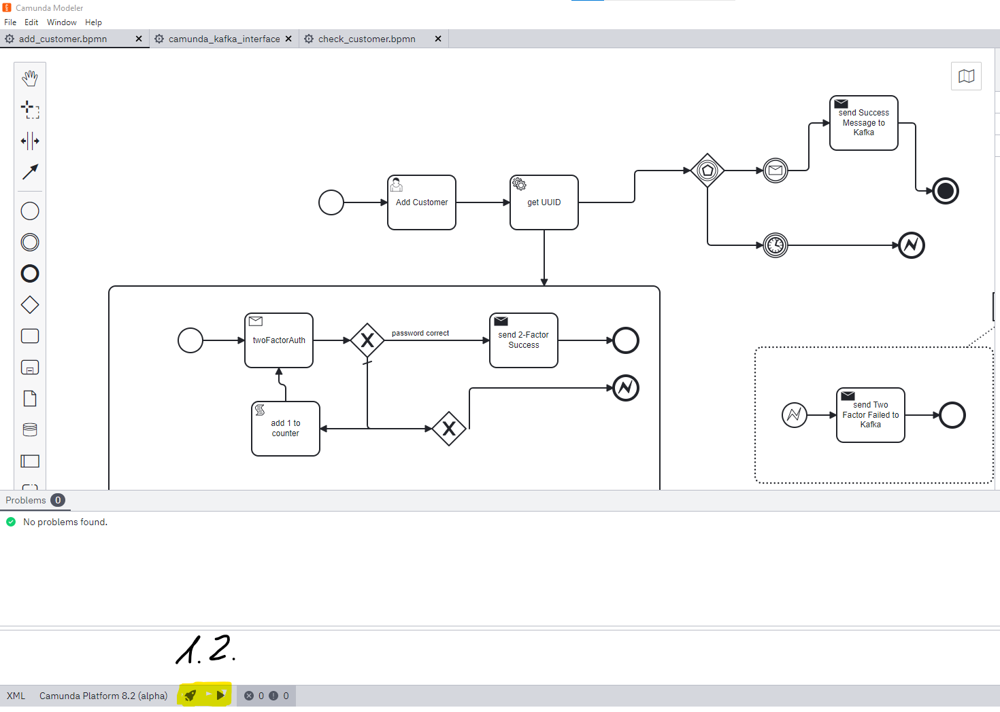
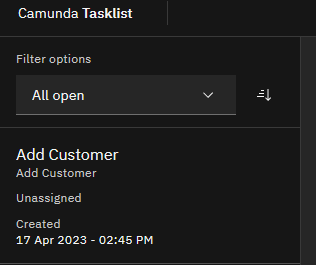
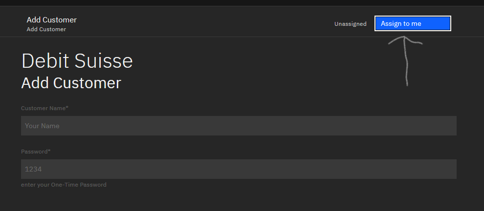
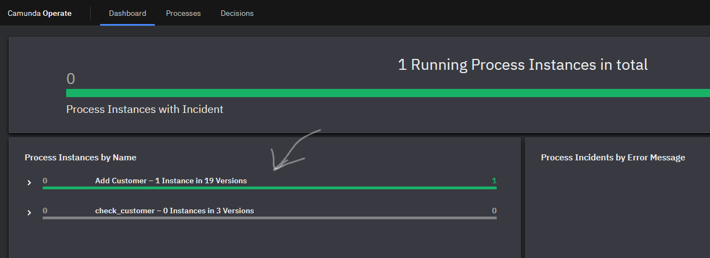
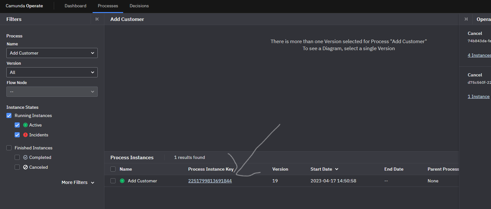
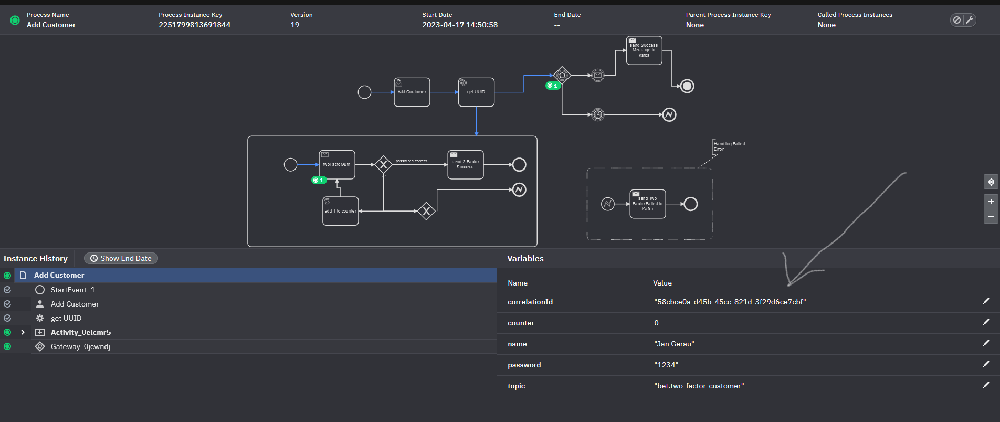

# Bet Platform

## Setup
install the following software:
- [Open Source Desktop Modeler](https://camunda.com/de/download/modeler/)

select Camunda Platform Version 8.2 (alpha) for all the documents created and creating.

## Build
```shell
cd bet-it
mvn clean install -DskipTests
docker-compose up --build -d
```

## Development
Run frontend in docker
```shell
cd bet-it
docker-compose -f docker-compose.yml up fraud-frontend --build 
docker-compose -f docker-compose.yml up fraud-backend --build
docker-compose -f docker-compose.yml up bank --build
docker-compose -f docker-compose.yml up bet-it-platform --build
docker-compose -f docker-compose.yml up game-master --build
```

### Monitor Kafka
open [kafdrop](http://localhost:9000) and have a look at the topics
## Add a User
### 1. Start Add User Workflow
```shell
1. curl --location --request POST 'localhost:8082/platform/addUser'
```
### 2. Do Usertask
Open [Zeebe Tasklist](http://localhost:8181) and login with user demo and password demo
### 3. Get Correlation ID
Open bet-platform logs and copy correlationId
### 4. Send 2FA Request
```shell
curl --location 'localhost:8082/platform/twoFactor' \
--header 'Content-Type: application/json' \
--data '{
    "user": "Ping",
    "password": "Passw12",
    "correlationId": "d3f4d0b1-f9be-4c9b-94cc-f788aec2e746"
}'
```


## Bank
### Add Balance 
```shell
curl --location 'localhost:8081/demo/add_money' \
--header 'Content-Type: application/json' \
--data '{"name": "klaus", "amount": 2000.0}'
```
### Show balances
```shell
curl --location 'localhost:8081/demo/balance'
```
### Wipe in-memory balances
```shell
curl --location 'localhost:8081/demo/wipe'
```
### Replay balances from kafka events
```shell
curl --location 'localhost:8081/demo/replay'
```
## Bet Platform
### Create Contract (Game must exist and contractorName User)
```shell
curl --location 'localhost:8082/platform/publishContract' \
--header 'Content-Type: application/json' \
--data '{
    "ratio": 4.3,
    "contractorName": "lukas",
    "gameId": "47ef6d49-ff73-4ff6-a91a-ac4e450276a7",
    "teamOneWinsContract": true
}'
```
### Checkout Contract State
```shell
curl --location 'localhost:8082/platform/contract/{contractId}
```
### Create Bet (Contract must be in accepted state)
```shell
curl --location 'localhost:8082/platform/publishBet' \
--header 'Content-Type: application/json' \
--data '{
   "buyerName": "albrecht",
   "amountBought": 20.01,
   "contractId": "eb21f70e-64e9-4c24-a517-50d62480c8ef"
}'
```
## Game
1. Go to http://localhost:3000
2. Publish a game
3. Create contract on the game
4. Create bet on the contract
5. Play the game
6. Use [operate-service](http://localhost:8180) to see the process workflows


## add a new User
1. Open Desktop Modeler
2. Open file bet-it/zeebe-addon/src/main/resources/add_customer.bpmn
3. Deploy and Run with the commands in the Desktop Modeler. For instructions see here: 
4. open [Zeebe Tasklist](http://localhost:8181) and login with user demo and password demo
5. Click on new Task 
6. Assign new Task to yourself  
7. Enter name and password and click "Complete Task"
8. open [Zeebe Operate](http://localhost:8180) and login with user demo and password demo
9. open Process Instance Dashboard 
10. select your created task 
11. copy "correlationId" to your clipboard 
12. POST localhost:8081/bank/twoFactor body: { "name": String, "correlationId": float, "password": String} with the correct user, password and correlationId you just copied
13. if you want to you can try it with a wrong password or user. After three tries the process will fail. Also if you take longer than one minute, the process will fail as well.
14. if done right, you can inspect [kafdrop](http://localhost:9000) for the topic bet.added-new-customer to see. Also intersting is the camunda topic. There you will see everything via the [Kafka Camunda API](#kafka-camunda-api)


## ToDos
- [ ] use Kafka Streaming to have a ledger
- [ ] use KSQL for the bet platform to keep the state of game, contracts and bets

## Kafka Camunda API
We were expecting Kafka and Camunda to operate more easily, so that you can tell camunda as a task (with an own implementation for every task) to post a topic on Kafka and for a Microservice to start a Camunda Process by posting something on Kafka.
In order to achieve this we implemented this API by ourselves in the bank microservice, where we are using the Camunda Tool. 
You can find the implemenation [here](zeebe-addon/src/main/java/ch/unisg) .
This API is transforming Kafka request from/to Camunda to/from Kafka depending on the map keys "messageName" and "topic". 
If the request to the camunda topic contains a "messageName" the API will create the camunda process with that name (if it exists). 
If the request does not contain a "messageName", but a topic it will post the variables of Camunda to the topic specified in the payload.
In order to use this feature from Camunda, a [ZeebeWorker](zeebe-addon/src/main/java/ch/unisg/ics/edpo/zeebe/ZeebeListener.java) was created, which automatically send the Camunda task to the camunda topic.
An example of how to use this feature from the Camunda side, please refer to [add_customer.bpmn](bank/src/main/resources/add_customer.bpmn).
An example of how to use this feature from the Microservice side, please refer to [BankController.java](bank/src/main/java/ch/unisg/controller/BankController.java)

### Add Connector Templates
If you want to use templates for the Camunda Desktop Modeler download the templates and follow the [instructions](https://docs.camunda.io/docs/self-managed/connectors-deployment/install-and-start/)

