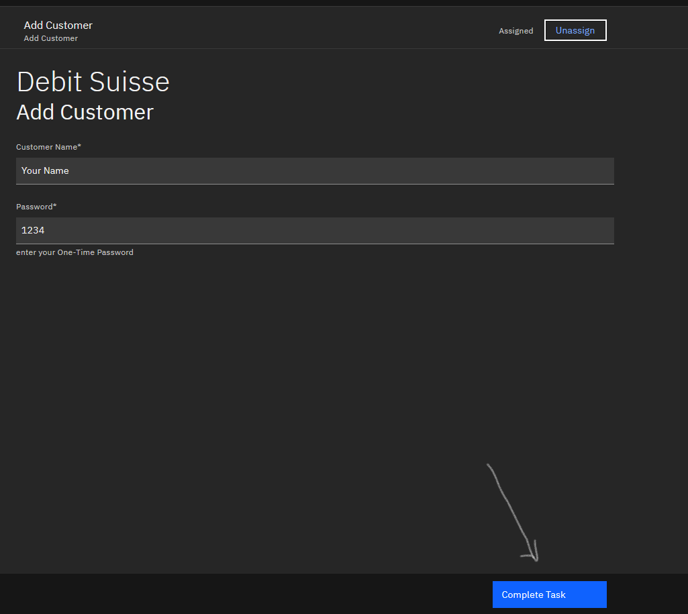
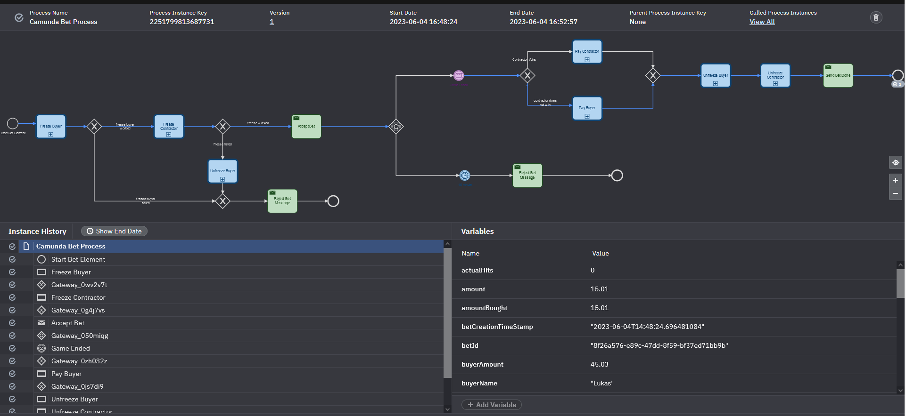

# Bet Platform
There is a glossary available [here](glossary.md).

## Setup
install the following software:
- [Open Source Desktop Modeler](https://camunda.com/de/download/modeler/)

select Camunda Platform Version 8.2 (alpha) for all the documents created and creating.

## Build
for Windows run
```shell
.\start-project.bat
```
for Linux run
```shell
.\start-project.sh
```

After the script has run, 21 (with the livescore API) docker container should be running for the bet-it application.[^1]
If not, try to re-run the script until successful. You can check it with:
```shell
docker-compose -f bet-it/docker-compose.yml ps
```

### Monitor Kafka
- open [kafdrop](http://localhost:9000) and have a look at the topics
- open [control-center](http://localhost:9021) and have a look at the schema of AVRO topics, like the bank.send-payment


## Add a User
1. Start Add User Workflow
```shell
curl --location --request POST 'localhost:8082/platform/addUser'
```
2. Do user task :: Open [Zeebe Tasklist](http://localhost:8181) and login with user demo and password demo




3. Get Correlation ID :: Open zeebe-addon logs with 
```shell
docker-compose -f bet-it/docker-compose.yml logs zeebe-addon
```
and look for Notification Service TwoFactor-Code: <correlationId>
copy this correlationId

4. Send 2FA Request
```shell
curl --location 'localhost:8082/platform/twoFactor' \
--header 'Content-Type: application/json' \
--data '{
    "user": "Your Name",
    "password": "1234",
    "correlationId": <correlationId>
}'
```
5. Open [Zeebe Operate](http://localhost:8180) and login with user demo and password demo


6. see how to process as been running through:

7.  if you want to you can try it with a wrong password or user. After three tries the process will fail. Also if you take longer than one minute, the process will fail as well.
8.  if done right, you can inspect [kafdrop](http://localhost:9000) for the topic bet.added-new-customer to see. Also intersting is the camunda topic. There you will see everything via the [Kafka Camunda API](#kafka-camunda-api)

### Debug with kafka
The same process can be "debugged" with having a look at the Kafka messages. Here there is a list on how it should go:

1. Start Add User Workflow
2. Do user task :: Open [Zeebe Tasklist](http://localhost:8181) and login with user demo and password demo
:: topic camunda.twofa with a JSON value like this
```javascript
{
   "passwordTest": "1234",
   "customerNameTest": "Your Name",
   "correlationId": "5afb6cdf-3ff2-46e2-9f13-48253e3f7225"
}
```
3. Get Correlation ID :: Open zeebe-addon logs with 
and look for Notification Service TwoFactor-Code: <correlationId>
copy this correlationId

4. Send 2FA Request
:: topic camunda.TwoFactorSuccessEvent with a JSON value like this
```javascript
{
   "topic": "camunda.TwoFactorSuccessEvent",
   "counter": 0,
   "password": "1234",
   "customerName": "Your Name",
   "passwordTest": "1234",
   "correlationId": "88b70241-9217-415f-b77a-198337970f08",
   "customerNameTest": "Your Name"
}
```
5. Open [Zeebe Operate](http://localhost:8180) and login with user demo and password demo
6. see how to process as been running through:
:: topic user.new with a JSON value like this
```javascript
{
   "topic": "user.new",
   "counter": 0,
   "password": "1234",
   "customerName": "Your Name",
   "passwordTest": "1234",
   "correlationId": "88b70241-9217-415f-b77a-198337970f08",
   "customerNameTest": "Your Name"
}


```

## Bank

### Add Money 
Now the users you just created (you need to add at least two users for a succesful bet) need money as well. Take the username and add money like this:
```shell
curl --location 'localhost:8081/demo/add_money' \
--header 'Content-Type: application/json' \
--data '{"name": "klaus", "amount": 2000.0}'
```
klaus is a placeholder for your user. You can set the amount for yourself as well.
### Show balances
If you want to check, whether this worked.
```shell
curl --location 'localhost:8081/demo/balance'
```
### Wipe in-memory balances
If you want to start from new.
```shell
curl --location 'localhost:8081/demo/wipe'
```
### Replay balances from kafka events
In case of system error, you can replay all the events of the bank.
```shell
curl --location 'localhost:8081/demo/replay'
```
## Game & Bet
### For the Game Budget Blaster
1. Go to http://localhost:3000
2. Add a player

3. refresh the page
4. Check if the player is appearing as a button

5. click on the button

6. enter how many hits you are going to make

7. enter a game name

8. Publish a game

9.  Refresh the page
10.  copy the GameId

11.  Create contract on the game (see below)
12.  Open [Zeebe Operate](http://localhost:8180) and login with user demo and password demo and you should see a CONTRACT_REQUESTED workflow run through like this:


13.  get the contractID in the header field of the contract creation request for creating the bet:

14.  Create bet on the contract (see below)
15.  Open [Zeebe Operate](http://localhost:8180) and login with user demo and password demo and you should see a Camunda Bet Process workflow running with a state like this:

16.  Play the game with clicking start game - good luck with hitting the black dots:


17.  After the game has ended, start a new game like the one before, but without creating a contract or a bet. This will trigger the game ended event kafka streaming app (see report on how this application looks like) to trigger the camunda.game.ended event evaluation (with the suppress)
18.  Refresh the [Zeebe Operate](http://localhost:8180) and you should see the process run through and depending on whether you hit the black dots enough, you should see a pay seller or a pay contractor event.


## Bet Platform
Side-Note: this workflow works independently of the Add-Customer workflow in order to achieve a greater decoupling.
### Create Contract (Game must exist and contractorName User)
```shell
curl --location 'localhost:8082/platform/publishContract' \
--header 'Content-Type: application/json' \
--data '{
    "ratio": 4.3, #ratio on how sure the contractor is
    "contractorName": "lukas", #should be a user with money
    "gameId": "47ef6d49-ff73-4ff6-a91a-ac4e450276a7",
    "teamOneWinsContract": true
}'
```
### Checkout Contract State
Check, whether the state is accepted with:
```shell
curl --location 'localhost:8082/platform/contract/{contractId}
```
### Create Bet (Contract must be in accepted state)
```shell
curl --location 'localhost:8082/platform/publishBet' \
--header 'Content-Type: application/json' \
--data '{
   "buyerName": "albrecht", #should be a use with money
   "amountBought": 20.01, #amount the user bets upon
   "contractId": "eb21f70e-64e9-4c24-a517-50d62480c8ef"
}'
```

### Debugging by looking at the kafka messages:
The same process can be "debugged" with having a look at the Kafka messages. Here there is a list on how it should go:
1. Go to http://localhost:3000
2. Add a player :: topic game.player with a JSON value like this
```javascript
{
   "playerName": "Test Player",
   "playerId": "cbbecebe-ff17-4b05-b6a8-8c5503ebce69"
}
```
3. refresh the page
4. Check if the player is appearing as a button
5. click on the button 
6. enter how many hits you are going to make
7. enter a game name
8. Publish a game :: topic camunda.game.started with a JSON value like this
```javascript
{
   "gameId": "c954ed87-3fb6-494a-901f-ad66eb0d62a2",
   "team1": "cbbecebe-ff17-4b05-b6a8-8c5503ebce69",
   "team2": "rest of the world",
   "description": "Test Game Name: cbbecebe-ff17-4b05-b6a8-8c5503ebce69; projectedHits: 1",
   "gameState": "PUBLISHED",
   "team1Wins": null,
   "projectedHits": 1,
   "username": "cbbecebe-ff17-4b05-b6a8-8c5503ebce69",
   "state": "STARTED"
}
```
9.  Refresh the page
10.  copy the GameId
11.  Create contract on the game (see below)
12.  Open [Zeebe Operate](http://localhost:8180) and login with user demo and password demo and you should see a CONTRACT_REQUESTED workflow run through.
:: topic camunda.user.check-result with JSON
```javascript
{
   "userResult": "APPROVED",
   "correlationId": "Jan",
   "user": "Jan"
}
```

:: topic camunda.game.valid-for-contract-result with JSON
```javascript
{
   "gameId": "c954ed87-3fb6-494a-901f-ad66eb0d62a2",
   "gameCheckResult": "APPROVED",
   "correlationId": "c954ed87-3fb6-494a-901f-ad66eb0d62a2"
}
```

:: topic contract.accepted with JSON
```javascript
{
   "topic": "contract.accepted",
   "user": "Jan",
   "ratio": 3,
   "gameId": "c954ed87-3fb6-494a-901f-ad66eb0d62a2",
   "contractId": "15b55022-c865-44c3-9d84-ac9fae526d05",
   "userResult": "APPROVED",
   "correlationId": "c954ed87-3fb6-494a-901f-ad66eb0d62a2",
   "contractorName": "Jan",
   "gameCheckResult": "APPROVED",
   "teamOneWinsContract": true
}
```
13.   get the contractID in the header field of the contract creation request for creating the bet.
14.   Create bet on the contract (see below)
:: topic camunda.freeze-result with JSON
```javascript
{
   "freezeAmount": 45.03,
   "freezeStatus": "ACCEPTED",
   "correlationId": "Lukas",
   "freezeUser": "Lukas"
}
```

15.   Open [Zeebe Operate](http://localhost:8180) and login with user demo and password demo and you should see a Camunda Bet Process workflow running.
:: topic camunda.freeze-result with JSON
```javascript
{
   "freezeAmount": 45.03,
   "freezeStatus": "ACCEPTED",
   "correlationId": "Lukas",
   "freezeUser": "Lukas"
}
```
16.   Play the game with clicking start game - good luck with hitting the black dots.
:: topic game.dot.spawn with JSON
```javascript
{
   "timestamp": "2023-06-04T14:50:50.147Z",
   "size": 41.43641562157481,
   "color": "black",
   "username": "cbbecebe-ff17-4b05-b6a8-8c5503ebce69",
   "gameId": "c954ed87-3fb6-494a-901f-ad66eb0d62a2",
   "projectedHits": 1
}
```
:: topic game.dot.hit with JSON
```javascript
{
   "timestamp": "2023-06-04T14:52:57.291Z",
   "size": 30.619919871648168,
   "color": "black",
   "username": "cbbecebe-ff17-4b05-b6a8-8c5503ebce69",
   "gameId": "8bec4106-1dca-4b59-b870-24f7e5d4c44c",
   "projectedHits": 1
}
```

and some more, in case of miss or friendly fire

17.   After the game has ended, start a new game like the one before, but without creating a contract or a bet. This will trigger the game ended event kafka streaming app (see report on how this application looks like) to trigger the camunda.game.ended event evaluation (with the suppress)
:: topic camunda.game.ended with JSON
```javascript
{
   "gameId": "c954ed87-3fb6-494a-901f-ad66eb0d62a2",
   "team1": "cbbecebe-ff17-4b05-b6a8-8c5503ebce69",
   "team2": "Rest of the World",
   "description": "DotSpawnEvent(super=DotEvent(timestamp=Sun Jun 04 14:51:02 UTC 2023, size=40.47835857559913, color=black, username=cbbecebe-ff17-4b05-b6a8-8c5503ebce69, gameId=c954ed87-3fb6-494a-901f-ad66eb0d62a2, projectedHits=1), dotEventType=SPAWN)",
   "gameState": "ENDED",
   "team1Wins": false,
   "projectedHits": 1,
   "actualHits": 0,
   "correlationId": "c954ed87-3fb6-494a-901f-ad66eb0d62a2"
}
```
:: topic camunda.transaction-result with JSON
```javascript
{
   "amount": 15.01,
   "transactionStatus": "DONE",
   "from": "Jan",
   "correlationId": "JanLukas",
   "to": "Lukas"
}
```

18.   Refresh the [Zeebe Operate](http://localhost:8180) and you should see the process run through and depending on whether you hit the black dots enough, you should see a pay seller or a pay contractor event.

## API2Kafka
1. start the fetching with
```shell
curl --location 'localhost:8099/start
```
2. observe [kafdrop](http://localhost:9000) on the topic game.published
3. if you are lucky, a game is published, so you can follow the same procedure as above by taking the gameId and bet on it


### Add Connector Templates
If you want to use templates for the Camunda Desktop Modeler download the templates and follow the [instructions](https://docs.camunda.io/docs/self-managed/connectors-deployment/install-and-start/)

[^1]: We spent several hours to make this 21 containers large application run on every device and also included runscripts to make it even more resilient. However, we know that setup-problems can occur anywhere. Should you encounter any problems you reckon unsolvable for you, do not hesistate to write an email to the developer. We are more than happy to help you with your setup-problem. If something is not working, it might be due to an error in the kafka-create-topics container. Due to working on linux and windows, there is sometimes a problem with the setup, we didn't manage to fully evaluate. Please try to change the file using the programm dos2unix. A clean docker setup restart (delete all container and run the start script again) ususally works. If not please do not hesistate to contact us.