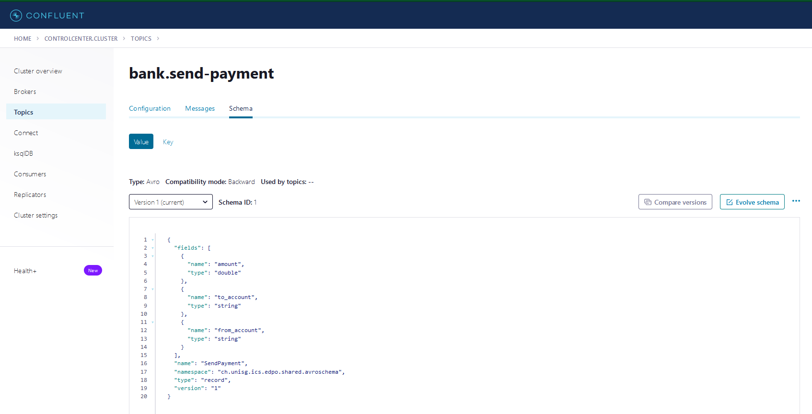

# Bet Platform

## Setup
install the following software:
- [Open Source Desktop Modeler](https://camunda.com/de/download/modeler/)

select Camunda Platform Version 8.2 (alpha) for all the documents created and creating.

## Build
for Windows run
```shell
.\start-project.bat
```
for Linux run
```shell
.\start-project.sh
```

### Monitor Kafka
- open [kafdrop](http://localhost:9000) and have a look at the topics
- open [control-center](http://localhost:9021) and have a look at the schema of AVRO topics, like the bank.send-payment


## Add a User
### 1. Start Add User Workflow
```shell
1. curl --location --request POST 'localhost:8082/platform/addUser'
```
### 2. Do Usertask
Open [Zeebe Tasklist](http://localhost:8181) and login with user demo and password demo
### 3. Get Correlation ID
Open bet-platform logs and copy correlationId
### 4. Send 2FA Request
```shell
curl --location 'localhost:8082/platform/twoFactor' \
--header 'Content-Type: application/json' \
--data '{
    "user": "Ping",
    "password": "Passw12",
    "correlationId": "d3f4d0b1-f9be-4c9b-94cc-f788aec2e746"
}'
```


## Bank
### Add Balance 
```shell
curl --location 'localhost:8081/demo/add_money' \
--header 'Content-Type: application/json' \
--data '{"name": "klaus", "amount": 2000.0}'
```
### Show balances
```shell
curl --location 'localhost:8081/demo/balance'
```
### Wipe in-memory balances
```shell
curl --location 'localhost:8081/demo/wipe'
```
### Replay balances from kafka events
```shell
curl --location 'localhost:8081/demo/replay'
```
## Bet Platform
### Create Contract (Game must exist and contractorName User)
```shell
curl --location 'localhost:8082/platform/publishContract' \
--header 'Content-Type: application/json' \
--data '{
    "ratio": 4.3,
    "contractorName": "lukas",
    "gameId": "47ef6d49-ff73-4ff6-a91a-ac4e450276a7",
    "teamOneWinsContract": true
}'
```
### Checkout Contract State
```shell
curl --location 'localhost:8082/platform/contract/{contractId}
```
### Create Bet (Contract must be in accepted state)
```shell
curl --location 'localhost:8082/platform/publishBet' \
--header 'Content-Type: application/json' \
--data '{
   "buyerName": "albrecht",
   "amountBought": 20.01,
   "contractId": "eb21f70e-64e9-4c24-a517-50d62480c8ef"
}'
```
## Game & Bet
1. Go to http://localhost:3000
2. Publish a game
3. Create contract on the game (see above)
4. Create bet on the contract (see above)
5. Play the game
6. Use [operate-service](http://localhost:8180) to see the process workflows


## add a new User

1. Send a Request to create a new User:
```shell
curl --location --request POST 'localhost:8082/platform/addUser'
``` 
2. open [Zeebe Tasklist](http://localhost:8181) and login with user demo and password demo
3. Click on new Task 
4. Assign new Task to yourself  
5. Enter name and password and click "Complete Task"
6. open the logs of the Zeebe-Addon:
```shell
docker-compose -f bet-it/docker-compose.yml logs zeebe-addon
``` 
and search for
```shell
Notification Service TwoFactor-Code: <correlationId>
``` 
7. copy "correlationId" to your clipboard 
8. POST localhost:8081/bank/twoFactor body: { "name": String, "correlationId": float, "password": String} with the correct user, password and correlationId you just copied
9.  if you want to you can try it with a wrong password or user. After three tries the process will fail. Also if you take longer than one minute, the process will fail as well.
10.  if done right, you can inspect [kafdrop](http://localhost:9000) for the topic bet.added-new-customer to see. Also intersting is the camunda topic. There you will see everything via the [Kafka Camunda API](#kafka-camunda-api)

### Add Connector Templates
If you want to use templates for the Camunda Desktop Modeler download the templates and follow the [instructions](https://docs.camunda.io/docs/self-managed/connectors-deployment/install-and-start/)

